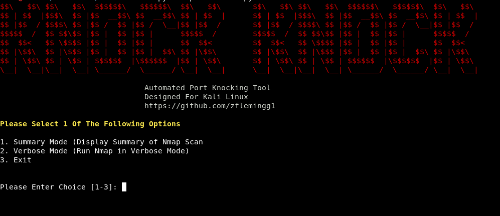
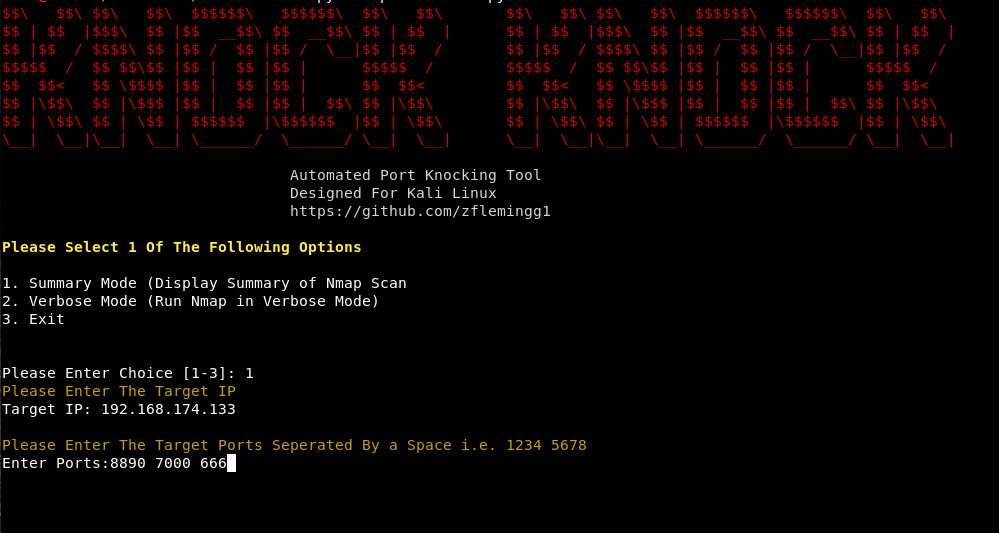
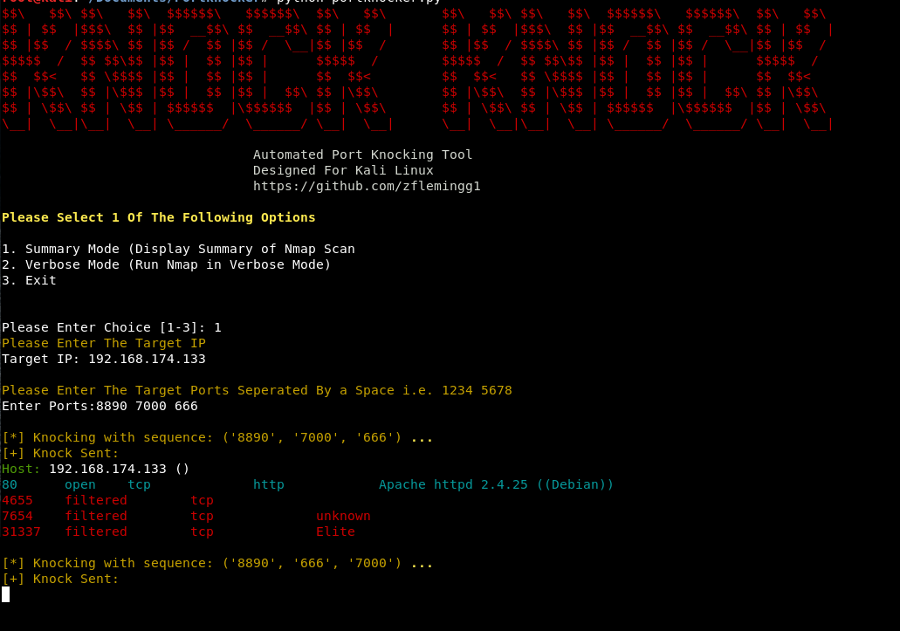
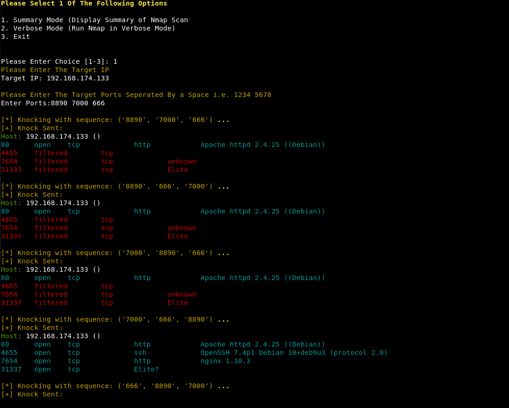
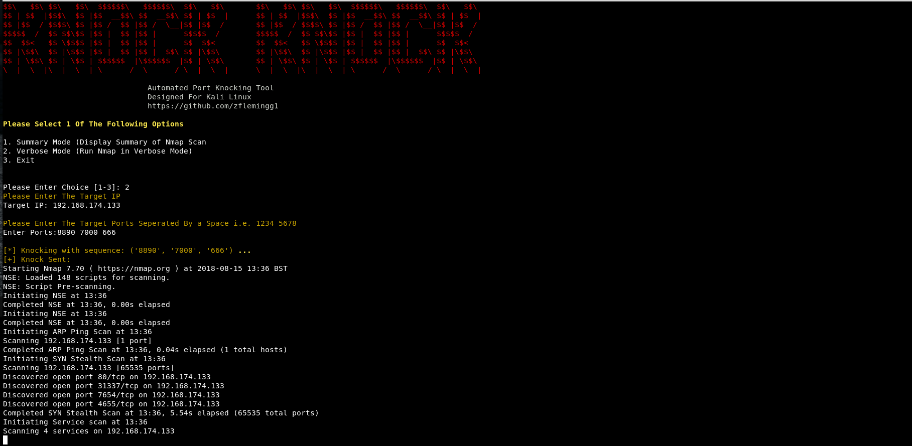

# Port Knocker
Simple Python tool to perform port knocking and output the the results in an easy user readable format.

### Basic Info
This tool was originally designed to help with some of the vulnhub challenges. There are loads of scripts available for this already, but some of the problems that I encountered with a lot of them were:

* Knowing the ports but not the right order
* You tried every combination but still nothing. This is because you could be opening the service, but then you happen to close it right after
* When you ‘knock’ a sequence (ex: 111 222 333) and then a different sequence immediately after (ex: 333 222 111). The daemon checking these knocks could possibly see (333 222 111) then (111 222 333) instead of your intended (111 222 333) then (333 222 111)

Some of the solution I found to be effective for the problems above:
* Knock every sequence of ports more than once, (at least 5 times) before trying another sequence
* After every attempted sequence wait some time and then run an nmap scan to see if the port u want to unlock is open

### Setup
To set up the tool simply clone it i.e. git clone. Navigate into that directory and then enter  pip install -r requirements.txt into the command line. This will install the required python modules if not already installed on your system.

### Launching The Program
To use the program simply open up a terminal navigate to the directory and run it with "python 'portknocker.py'"

### Running The Program

The program can be run in one of two modes. Summary mode - this will summarise the nmap output and display neatley to the user. This should be fine for most situations. Verbose mode - this will display all nmap output

Once you have selected which mode to run it in, it will then ask you for the target IP and Ports.

Example Of Output in Summary Mode

Example Of Output in Verbose Mode

### Built With

* Python 2.7.14

### Authors

*** Zach Fleming --> zflemingg1@gmail.com

